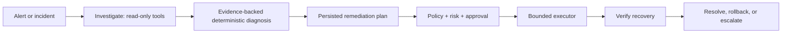

# Governed AI SRE Auto-Remediation Platform

A local-first control plane for evidence-backed incident investigation and bounded remediation. It separates AI-style diagnosis from authoritative policy, approval, executor preconditions, verification, and audit records.



## Working vertical slice

The bad-deployment lab produces 5xx/readiness/deployment evidence, diagnoses a deployment regression, proposes rollback, blocks production execution until a separate approver acts, rechecks plan preconditions, rolls back, verifies health, and records a timeline. The executor is a deterministic local lab backend—not a claim of real Kubernetes validation.

```bash
python -m pip install -e '.[dev]'
make test lint
make demo-bad-deploy
make demo-unsafe-plan
```

The unsafe-plan demo proves `delete_namespace` is not an allowed capability. There is no arbitrary shell, kubectl passthrough, cluster-admin credential, or autonomous approval path.

See [safety model](docs/safety-model.md), [lifecycle](docs/incident-lifecycle.md), and [roadmap](docs/roadmap.md).
